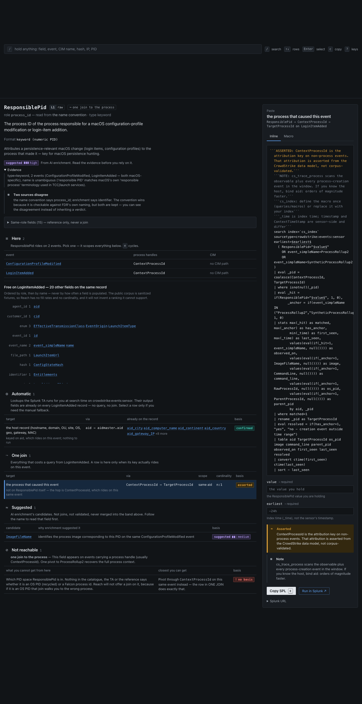

# Reach

**What can I reach from this field, what does it cost, and how much should I trust it?**

Reach is a pivot map for CrowdStrike Falcon Data Replicator data in Splunk. You
arrive holding one thing — a field name you don't recognise, a PID from a ticket,
a host, a detection, a hash — and it answers four questions in order:

1. **What's already here?** The other fields on the same event. Free, no query.
2. **What's one join away?** Each reachable target with its key, scope,
   cardinality, and whether the join is *confirmed* or *asserted*. Lookups
   the add-on already applies at search time are shown separately as
   already on the record.
3. **What's unreachable?** And the closest you can get.
4. **What do I paste?** Correct SPL for the pivot you picked, scoped, with the
   hazards shown beside it.

It is a reference tool. There is no backend, no telemetry, and no network
access — including to Splunk. You paste what it gives you.



## Run it

No build step, no dependencies, no internet.

```bash
python3 -m http.server 8000
# open http://localhost:8000/
```

Serve from the repo root. Opening `index.html` from the filesystem will not
work — browsers block `fetch()` on `file://`, and the app will tell you so.

## Background

The FDR schema has 1,792 fields and 275 event types, and CrowdStrike does not
publish the dictionary. `ContextProcessId` is what attributes a DNS lookup to
a process; `RawProcessId` is an OS PID that the kernel recycles; 219 event
types have no CIM representation. Reach carries that.

## Rules

- **Join basis is always shown.** Three joins are *confirmed* — the Splunk
  add-on performs them (`aid` → `aidmaster`, `SHA256HashData` → `appinfo`,
  `UserSid` → `userinfo`). The rest are *asserted*: CrowdStrike data-model
  semantics not validated against a real corpus. The label is shown with
  every pivot and beside every generated search.
- **`RawProcessId` searches require a host and a time window.** It is the OS
  PID and the OS recycles it. The generator throws without both.
- **No arithmetic PID conversion.** `TargetProcessId` and `RawProcessId` are
  not related by any formula — four hypotheses were tested against 28
  documents carrying both and all failed. Translation is a lookup against
  events that carry both, and it is ambiguous in one direction.
- **No fill rates, cardinality, or "most populated" ordering.** The public
  corpus is sanitized pipeline fixtures; those numbers are not derivable
  from it.
- **AI-synthesized suggestions stay separate from the join graph.** 785
  fields carry machine-generated semantics; each displays its confidence and
  evidence, in its own band.

## What's in the box

<!-- reach:stats -->
| Stat | Value |
|---|---|
| Fields | 1792 |
| raw FDR / TA-derived / CIM | 1471 / 242 / 79 |
| Events | 275 |
| Events CIM-normalized / gap | 56 / 219 |
| Enriched fields (batches) | 785 (16) |
| Decode tables (values) | 169 (1370) |
| Edges confirmed / asserted | 3 / 6 |
| Suggested joins | 651 |
| Unclassified | 17 |

Generated by build_knowledge_base.py at 2026-09-16T23:01:42Z (TA 3.2.0, bundle e35c7c5a4e97).
<!-- /reach:stats -->

That table is generated from `app/data/manifest.json` by the build. No count
in this README or in the UI is typed by hand.

## Layout

```
index.html          the app
app/                views, components, libraries
  lib/spl.js        the only code that emits SPL
  data/             GENERATED by the build — do not edit
data/               build inputs: public schema, CIM mappings, enrichment, curated edges
tools/              the build and the extraction scripts that produce data/
queries/            reference SPL and Splunk Cloud macros
docs/               architecture, data model, decision log, roadmap
tests/
```

## Rebuilding the data

```bash
python3 tools/build_knowledge_base.py --readme README.md
```

Stdlib only. The build fails rather than emit a bundle with a name collision,
an edge without a citable basis, or curated knowledge that names an event
which does not exist.

## Tests

```bash
node --test tests/                    # SPL generator invariants, classifier, router, views, contrast
python3 -m unittest discover tests    # data-layer invariants
```

## Documentation

- [`docs/ARCHITECTURE.md`](docs/ARCHITECTURE.md) — bundle schema, SPL generator
  contract, design system
- [`docs/DATA_MODEL.md`](docs/DATA_MODEL.md) — provenance layers, join graph,
  what the TA provides
- [`docs/FDR_REFERENCE.md`](docs/FDR_REFERENCE.md) — where the schema comes from
- [`docs/ROADMAP.md`](docs/ROADMAP.md) — known gaps, in order

## Caveats

The reference queries and generated SPL were written from the schema, not
validated against a live Splunk instance. Run them once against data you
already understand before you rely on them in an investigation.

Join semantics marked *asserted* have not been validated against tenant data.
Validating one is the most useful contribution.

## License

MIT — see [`LICENSE`](LICENSE).
